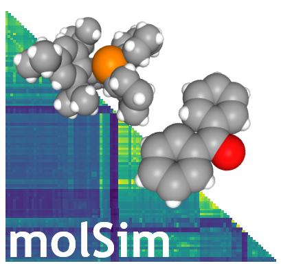

# molSim README

molSim is a tool for visualizing diversity in your molecular data-set using structural fingerprints. 

## Documentation
[View our Online Documentation](https://himaghna.github.io/molSim/)

## Purpose

__Why Do We Need To Visualize Molecular Similarity / Diversity?__

There are several contexts where it is helpful to visualize the diversity of a molecular dataset:

_Exploratory Experimental Synthesis_

For a chemist, synthesizing new molecules with targeted properties is often a laborious and time consuming task.
In such a case, it becomes useful to check the similarity of a newly proposed (un-synthesized) molecule to the ones already synthesized.
If the proposed molecule is too similar to the existing repertoire of molecules, it will probably not yield not enough new information /
property and thus need not be synthesized. Thus, a chemist can avoid spending
time and effort synthesizing molecules not useful for the project.

_Lead Optimization and Virtual Screening_

This application is the converse of exploratory synthesis where the interest is to find molecules in a database which are structurally similar to an "active" molecule. In this context, "active" might refer to pharmocological activity (drug discover campaigns) or desirable chemical properties (for example, to discover alternative chemicals and solvents for an application). In such a case, molSim helps to run virtual screenings over a molecular database and visualize the results.

_Machine Learning Molecular Properties_

In the context of machine learning, visualizing the diversity of the training set gives a good idea about its information quality.
A more diverse training data-set yields a more robust model, which generalizes well to unseen data. Additionally, such a visualization can 
identify "clusters of similarity" indicating the need for separately trained models for each cluster.

_Substrate Scope Robustness Verification_

When proposing a novel reaction it is essential for the practicing chemist to evaluate the transformation's tolerance of diverse functional groups and substrates (Glorius, 2013). Using `molSim`, one can evaluate the structural and chemical similarity across an entire susbtrate scope to ensure that it avoids redundant species. Below is an example similarity heatmap generated to visualize the diversity of a three-component sulfonamide coupling reaction with a substantial number of substrates (Chen, 2018).

Many of the substrates appear similar to one another and thereby redundant, but in reality the core sulfone moiety and the use of the same coupling partner when evaluating functional group tolerance accounts for this apparent shortcoming. Also of note is the region of high similarity along the diagonal where the substrates often differ by a single halide heteratom or substitution pattern.

## Installing molSim
### Pip _(preferred method)_
Required dependency _RDKit_ is only available first-party through _conda_. To install molSim using pip, run the following command: `pip install molSim`. You may then need to install `RDKit` using _conda_: run `conda install -c rdkit rdkit` to install it. 

### Conda
Install all depedencies at once with:

`conda install -c jacksonburns molsim`

Or build everything manually, using the following command with conda to create an environment:
`conda create --name your-env-name --file requirements.txt`

## Running molSim
Start `molSim` with a graphical user interface:

`molSim`

Example Run:

`molSim config.yaml`

Using multiprocessing:

`molSim` includes support for multiprocessing to split up the work of molecular comparisons across multiple CPU cores, speeding up execution. Because there is a cost associated with creating and destroying these processes, setting `n_workers` to any number larger than 1 is _not_ reccomended for datasets smaller than ~5000 molecules.

Tests:

`python -m unittest discover`

_Note: Multiprocessing speedup and efficiency tests take more than 10 hours to run due to the number of replicates required. To run these tests, create a file called `.speedup-test` in the `molSim` directory and execute the above command as shown._

To build the docs, execute the following with `sphinx` and `m2r` installed and from the `/docs` directory:

`m2r ../README.md | mv ../README.rst . | sphinx-apidoc -f -o . .. | make html | cp _build/html/* .`

For packaging on Pypi:

`python -m build; twine upload dist/*`

For packaging on conda:

`conda build .; conda upload /path/to/.bz2`

### Currently Implemented Fingerprints

1. Morgan Fingerprint (Equivalent to the ECFP fingerprints)
2. RDKit Topological Fingerprint
3. RDKit Daylight Fingerprint
4. All fingerprints available from the [ccbmlib](https://github.com/vogt-m/ccbmlib) package (_specify 'ccbmlib:descriptorname' for command line input_).
5. All descriptors available through the [Mordred](https://github.com/mordred-descriptor/mordred) library (_specify 'mordred:desciptorname' for command line input._).

### Currently Implemented Similarity Scores

44 commonly used similarity scores are implemented in molSim.
Additional L0, L1 and L2 norm based similarities are also implemented. [View our Online Documentation](https://himaghna.github.io/molSim/) for a complete list of implemented similarity scores.

### Currently Implemented Functionalities

1. <b> Measure Search</b>: Automate the search of fingerprint and similarity metric (called a "measure") using the following algorithm: \
&nbsp;&nbsp;&nbsp;&nbsp;    <b><i>Step 1</b></i>: Select an arbitrary featurization scheme. \
&nbsp;&nbsp;&nbsp;&nbsp;    <b><i>Step 2</b></i>: Featurize the molecule set using the selected scheme.  \
&nbsp;&nbsp;&nbsp;&nbsp;    <b><i>Step 3</b></i>: Choose an arbitrary similarity measure. \
&nbsp;&nbsp;&nbsp;&nbsp;    <b><i>Step 4</b></i>: Select each molecule’s nearest and furthest neighbors in the set using the similarity measure. \
&nbsp;&nbsp;&nbsp;&nbsp;    <b><i>Step 5</b></i>: Measure the correlation between a molecule’s QoI and its nearest neighbor’s QoI. \
&nbsp;&nbsp;&nbsp;&nbsp;    <b><i>Step 6</b></i>: Measure the correlation between a molecule’s QoI and its further neighbor’s QoI. \
&nbsp;&nbsp;&nbsp;&nbsp;    <b><i>Step 7</b></i>: Define a score which maximizes the value in Step 5 and minimizes the value in Step 6. \
&nbsp;&nbsp;&nbsp;&nbsp;    <b><i>Step 8</b></i>: Iterate Steps 1 – 7 to select the featurization scheme and similarity measure to maximize the result of Step 7. 
2. <b>See Property Variation with Similarity</b>: Visualize the correlation in the QoI between nearest neighbor molecules (most similar pairs in the molecule set) and between the furthest neighbor molecules (most dissimilar pairs in the molecule set). This is used to verify that the chosen measure is appropriate for the task.

3. <b>Visualize Dataset</b>: Visualize the diversity of the molecule set in the form of a pairwise similarity density and a similarity heatmap of the molecule set.

4. <b>Compare Target Molecule to Molecule Set</b>: Run a similarity search of a molecule against a database of molecules (molecule set). This task can be used to identify the most similar (useful in virtual screening operations) or most dissimilar (useful in application that require high diversity such as training set design for machine learning models) molecules.

5. <b>Cluster Data</b>: Cluster the molecule set. The following alogirthms are implemented: \
&nbsp;&nbsp;&nbsp;&nbsp;    <i>For arbitrary molecular features or similarity metrics with defined Euclidean distances</i>: K-Medoids[3] and Ward[4] (hierarchical clustering). \
&nbsp;&nbsp;&nbsp;&nbsp;    <i>For binary fingerprints </i>: Complete, single and average linkage hierarchical clustering[4]. \
The clustered data is plotted in two dimensions using multi-dimensional scaling[5].

6. <b>Outlier Detection</b>: Using an isolation forest, check for which molecules are potentially novel or are outliers according to the selected descriptor. Output can be directly to the command line by specifiying `output` to be `terminal` or to a text file by instead providing a filename.

## Credits and Licensing

Developer: Himaghna Bhattacharjee, Vlachos Research Lab. ([LinkedIn](www.linkedin.com/in/himaghna-bhattacharjee))

Developer: Jackson Burns, Don Watson Lab. ([Personal Site](https://www.jacksonwarnerburns.com/))

## License
MIT Open

## Works Cited
[1] Collins, K. and Glorius, F., A robustness screen for the rapid assessment of chemical reactions. Nature Chem 5, 597–601 (2013). https://doi.org/10.1038/nchem.1669

[2] Chen, Y., Murray, P.R.D., Davies, A.T., and Willis M.C., J. Am. Chem. Soc. 140 (28), 8781-8787 (2018). https://doi.org/10.1021/jacs.8b04532

[3] Hastie, T., Tibshirani R. and Friedman J., The Elements of statistical Learning: Data Mining, Inference, and Prediction, 2nd Ed.  (Springer Series in Statistics). 2009.

[4] Murtagh, F. and Contreras, P., Algorithms for hierarchical clustering: an overview. WIREs Data Mining Knowl Discov (2011). https://doi.org/10.1002/widm.53

[5]Borg, I. and Groenen, P.J.F., Modern Multidimensional Scaling: Theory and Applications (Springer Series in Statistics). 2005.

